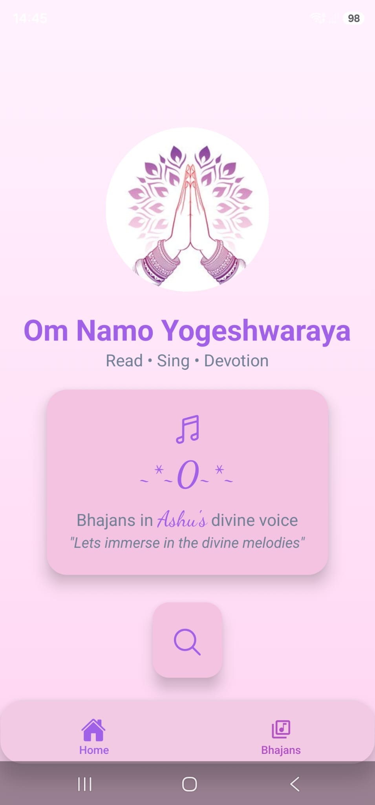
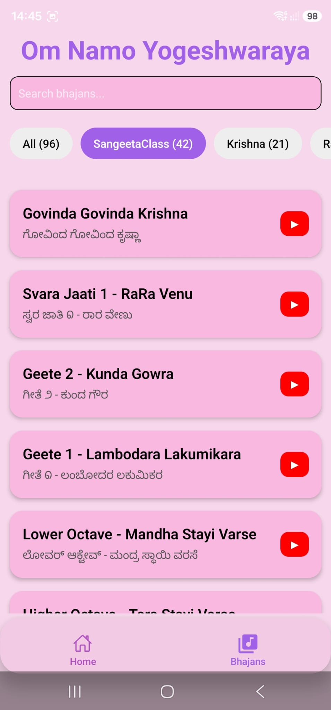
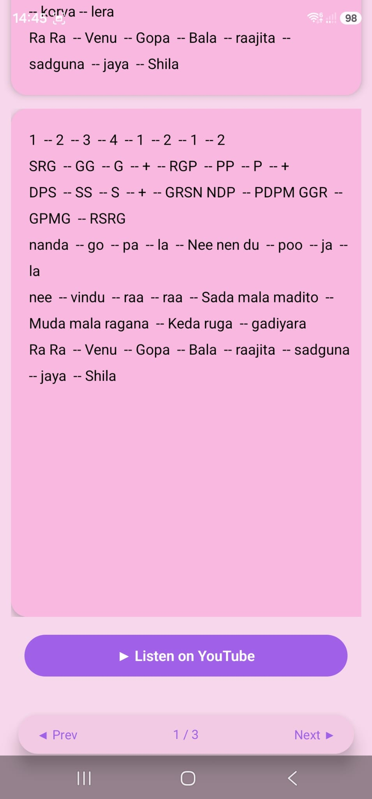

# Bhajans Mobile — Android Devotional Lyrics App

A React Native / Expo mobile application created for my spiritual community to make devotional lyrics easy to access, search, read, and navigate during gatherings.

This mobile app is the Android companion to the Bhajans web application.

🌐 **Web App:**  
https://bhajans-app-chi.vercel.app/

💻 **Web Repository:**  
https://github.com/A-nu-1/bhajans-app

---

## Why I Built This

In my spiritual community, many devotional songs are sung regularly.

As the song collection grew, it became difficult to search through large files and quickly find the right lyrics during gatherings.

I built Bhajans Mobile so users can carry the song library with them and access lyrics directly from their phones.

The goal is simple:

- find songs quickly
- read lyrics clearly
- navigate easily during gatherings
- support multiple languages
- reduce dependence on large document files

---

## Screenshots

### Home & Song Search



### Structured Search and List



### Reader and Youtube



---

## Mobile Experience

The app is designed around real-world mobile use.

A typical flow is:

```text
Open App
   ↓
Search or Browse Categories
   ↓
Open Bhajan
   ↓
Read Structured Lyrics
   ↓
Move to Previous / Next Song
```

The interface is kept simple so users can focus on the devotional gathering rather than the app itself.

---

## Main Features

### Search

Users can quickly search the bhajan library instead of manually navigating long documents.

### Categories

Songs can be organized into devotional categories such as:

- Ganesha
- Guru
- Durga
- Hanuman
- Krishna
- Lakshmi
- and other categories

### Structured Reader

Lyrics are displayed in a clean paragraph-based format.

The reader supports:

- clear verse separation
- previous / next navigation
- easy scrolling
- mobile-friendly reading
- multilingual lyrics

### Favorites

Frequently used songs can be saved for quick access.

### Multilingual Content

The application supports devotional lyrics across multiple languages and scripts.

### Transliteration Support

The wider Bhajans platform includes transliteration tools for converting text between supported scripts while preserving pronunciation.

This is transliteration, not translation.

---

## Technology Stack

### Mobile

- React Native
- Expo
- Expo Router
- TypeScript

### Backend / Data

The mobile app connects to the same Bhajans application data and APIs used by the wider project.

### Development

- Git
- GitHub
- Expo development tools

---

## Project Structure

A typical structure includes:

```text
src/
├── app/
├── components/
├── lib/
├── constants/
└── assets/
```

The application is structured around Expo Router for navigation.

---

## Running the App Locally

### 1. Clone the repository

```bash
git clone https://github.com/A-nu-1/bhajans-mobile.git
```

### 2. Enter the project directory

```bash
cd bhajans-mobile
```

### 3. Install dependencies

```bash
npm install
```

### 4. Configure environment variables

Create the required local environment configuration.

Do not commit private credentials or `.env` values to GitHub.

### 5. Start Expo

```bash
npx expo start
```

If using a development build:

```bash
npx expo start --dev-client
```

If Metro cache needs to be cleared:

```bash
npx expo start --dev-client --clear
```

---

## Android Build

The project can be built for Android using Expo Application Services (EAS).

Example preview build:

```bash
eas build --platform android --profile preview
```

This can generate an Android build for testing without publishing to the Play Store.

---

## Related Web Application

The Bhajans web application provides the same community-focused concept in a browser-based experience.

### Live Web App

https://bhajans-app-chi.vercel.app/

### Web Repository

https://github.com/A-nu-1/bhajans-app

---

## What This Project Demonstrates

This project demonstrates hands-on experience with:

- React Native development
- Expo
- Expo Router
- mobile navigation
- API integration
- multilingual content
- mobile UI design
- shared web/mobile product thinking
- Android build workflows
- community-centered software design

---

## Engineering Focus

The mobile application focuses on:

- simple navigation
- readable mobile layouts
- fast song discovery
- maintaining feature parity with the web experience where useful
- reliable access to devotional content on Android devices

---

## Possible Future Enhancements

Potential improvements include:

- better offline access
- downloadable song collections
- improved favorites organization
- event-specific song lists
- enhanced font controls
- more language options
- better media integration
- additional accessibility options

---

## Author

**Anupama Rajendra**

Software Engineer  
**Java · SQL · Unix / Shell Scripting · Enterprise Integration · Full-Stack · Mobile**

### Links

**Portfolio**  
https://A-nu-1.github.io/anupamaportfolio/

**GitHub**  
https://github.com/A-nu-1

**Bhajans Web App**  
https://bhajans-app-chi.vercel.app/

---

## Project Purpose

Bhajans Mobile is a personal community project built to make devotional lyrics easier to access during real-world gatherings.

It complements the web application by bringing the same song library and reading experience to Android devices. 🩷